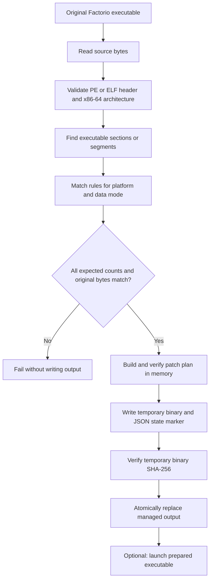

# Factorio Achievement Unlocker

A cautious, local command-line tool that prepares a verified, separate Factorio executable for modded achievement play without modifying the original game binary.

[](pyproject.toml)
[](LICENSE)
[](pyproject.toml)
[](#tech-stack--architecture)
[](#tech-stack--architecture)

[Русская версия](README.ru.md)

> [!IMPORTANT]
> This repository is a Factorio executable preparation tool, **not a logging library**. This README documents the actual code and behavior in this repository; it does not describe logging APIs or capabilities that are not present.

> [!WARNING]
> Compatibility depends on the exact Factorio build. The bundled byte-signature profiles are based on earlier community research and have **not** been validated against a current game binary in this workspace. If any enabled signature has an unexpected match count, the tool stops without writing a prepared executable. There is no force option.

## Table of Contents

- [Features](#features)
- [Tech Stack & Architecture](#tech-stack--architecture)
- [Getting Started](#getting-started)
- [Testing](#testing)
- [Deployment](#deployment)
- [Usage](#usage)
- [Configuration](#configuration)
- [License](#license)
- [Contacts & Community Support](#contacts--community-support)

## Features

- **Separate executable output:** creates `factorio-unlocked` or `factorio-unlocked.exe` beside the original by default; the original `factorio`/`factorio.exe` is never patched or overwritten.
- **Windows and Linux x86-64 support:** recognizes PE32+ x86-64 and little-endian 64-bit ELF x86-64 executable images.
- **Executable-code-only scanning:** searches PE executable sections or ELF executable load segments rather than scanning arbitrary file data.
- **Preflight inspection:** `inspect` validates the selected profile and displays planned byte edits without changing files.
- **Strict signature validation:** every enabled rule must match exactly its expected number of times; the original opcode is checked before each edit.
- **Patch-plan safeguards:** rejects invalid executable headers, unsupported architectures, missing or ambiguous signatures, out-of-range edits, and overlapping edits.
- **In-memory verification:** validates the source hash before applying edits, checks patched bytes, and verifies that the resulting file size is unchanged.
- **Managed-copy tracking:** writes a neighboring JSON marker with source/output SHA-256 digests, data mode, binary format, and the edit manifest.
- **Guarded updates and removal:** refuses to overwrite or delete an output whose contents have changed outside the tool; preserves a previous output hash to support recovery from interrupted updates.
- **Atomic output replacement:** writes temporary files in the destination directory and uses replacement operations to avoid exposing a partially written executable.
- **Modded and vanilla data modes:** defaults to `modded`; `vanilla` selects the regular achievement data file where supported by the profile.
- **Launch support:** refreshes the managed output as needed and starts it with optional game arguments.
- **Offline operation:** runs locally and does not download or execute remote code.
- **No save-file editing:** does not alter saves or remove restrictions associated with cheats or console commands.

## Tech Stack & Architecture

### Technology

- **Language:** Python 3.10 or newer.
- **Packaging and build backend:** `pyproject.toml`, setuptools, and the PEP 517 build interface.
- **Runtime dependencies:** Python standard library only; the project declares no third-party runtime dependencies.
- **Test framework:** Python `unittest`.
- **Supported binary formats:** PE32+ and ELF, both restricted to x86-64 executable regions.
- **Command-line interface:** `argparse`, installed as `factorio-achievement-unlocker`.

### Project Structure

```text
.
├── README.md                         # Project documentation
├── README.ru.md                      # Russian documentation
├── ATTRIBUTION.md                    # Signature research provenance
├── LICENSE                           # MIT license for this implementation
├── pyproject.toml                    # Package metadata and console entry point
├── src/
│   └── factorio_achievement_unlocker/
│       ├── __init__.py                # Package version and CLI entry import
│       ├── __main__.py                # python -m entry point
│       ├── cli.py                     # Argument parsing and command dispatch
│       ├── engine.py                  # Binary validation, planning, writing, restore
│       └── profiles.py                # Platform-specific signature/edit rules
├── tests/
│   └── test_engine.py                 # Synthetic PE/ELF and safety tests
├── third_party/
│   ├── FAE_Linux-LICENSE               # Apache-2.0 notice for Linux research source
│   └── FactorioAchievementEnabler-LICENSE # MIT notice for Windows research source
└── build/
    └── wheels/                         # A wheel artifact included in this checkout
```

> [!NOTE]
> `build/wheels/` contains a packaged wheel in this checkout. It is a build artifact, not the source of truth. Build fresh distributions from `pyproject.toml` and the source tree when preparing a release.

### Key Design Decisions

- **Plan first, write later.** A complete patch plan is generated and validated before the destination is changed. Unsupported or ambiguous binaries fail closed.
- **Narrow search scope.** Rule matching is constrained to executable portions of a recognized PE or ELF image.
- **Hash-bound state.** A sidecar marker binds a prepared output to the source path and content hashes. Existing user data is preserved when a file is unmanaged or no longer matches the recorded hashes.
- **Atomic managed output.** The binary and marker are assembled in temporary files within the output directory; the implementation verifies the temporary binary before replacement and rolls the marker back if binary replacement fails.
- **No hidden configuration.** There are no environment-variable settings, `.env` files, or external configuration files. Behavior is selected using explicit CLI options.
- **Provenance is documented separately.** This implementation is newly written; its platform-specific signatures draw on research from separate projects. See [ATTRIBUTION.md](ATTRIBUTION.md) and the retained third-party license notices.

<details>
<summary>Binary preparation data flow</summary>



The sidecar file is named `<output>.unlocker.json`. The original executable remains the source of truth; the generated copy can be removed with `restore` only while the marker and file hashes pass the tool's safety checks.

</details>

## Getting Started

### Prerequisites

- Python **3.10+**.
- A supported Factorio **Windows or Linux x86-64** executable.
- Read access to the source executable and write access to the output directory.
- On Windows, use PowerShell or another shell capable of passing quoted filesystem paths.

No Docker daemon, compiler toolchain, network connection, or native library is required at runtime.

### Installation

Clone the repository and install the CLI in editable mode:

```sh
git clone https://github.com/FCTostin-team/Factorio-Achievement-Unlocker.git
cd Factorio-Achievement-Unlocker
python -m venv .venv
. .venv/bin/activate
python -m pip install -e .
```

Confirm the command is available:

```sh
factorio-achievement-unlocker --help
```

On Windows, the equivalent install commands can be run from PowerShell:

```powershell
git clone https://github.com/FCTostin-team/Factorio-Achievement-Unlocker.git
Set-Location Factorio-Achievement-Unlocker
py -m venv .venv
.\.venv\Scripts\Activate.ps1
python -m pip install -e .
factorio-achievement-unlocker --help
```

<details>
<summary>Install or build alternatives and troubleshooting</summary>

**Build a wheel from source** (requires a Python packaging frontend such as `pip`):

```sh
python -m pip install build
python -m build --wheel
python -m pip install dist/factorio_achievement_unlocker-*.whl
```

**Install directly from the checked-out source without editable mode:**

```sh
python -m pip install .
```

**Common issues:**

- `externally-managed-environment` from pip: use a virtual environment as shown above; avoid overriding the operating system's Python package protection.
- `factorio-achievement-unlocker: command not found`: check that installation succeeded and that Python's scripts directory is on `PATH`. You can also invoke the package module with `python -m factorio_achievement_unlocker` from an installed environment.
- `Output directory does not exist`: create the directory first, or choose a path whose parent already exists. The tool does not create missing destination directories.
- `unsupported` / unexpected signature count: the installed game build does not match the bundled profile. Do not force the patch; use an explicitly verified profile for that exact game build.
- Permission errors: install or run with access to read the source and write to the chosen output directory. The program does not require elevated privileges unless the chosen location itself requires them.

</details>

## Testing

Run the repository's test suite from the project root. Install the package first so the `src/` package is importable:

```sh
python -m pip install -e .
python -m unittest discover -s tests -v
```

The suite exercises synthetic PE and ELF fixtures, signature matching at region boundaries, both data modes, patch application, unmanaged/external file preservation, marker validation, update rollback, interrupted-update recovery, and Unix permission handling. The permission-bit test is skipped on Windows.

There are no separately configured integration-test command, coverage runner, type checker, or linter in this repository. Do not treat an unconfigured command such as `pytest`, `flake8`, or `npm test` as a project-supported test target.

## Deployment

This is a local command-line utility, not a network service. There is no server deployment, Docker image, Docker Compose stack, or production daemon to operate.

For a reproducible Python distribution, build and test a wheel:

```sh
python -m pip install build
python -m unittest discover -s tests -v
python -m build --wheel
```

Install the resulting wheel with `python -m pip install dist/factorio_achievement_unlocker-*.whl`. A release workflow can run these commands on supported Python versions, retain the wheel as an artifact, and publish it to the chosen package registry; this repository does not currently define a CI/CD pipeline or registry publishing configuration.

For gameplay, run `prepare` or `launch` against the installed game and use the generated copy. Keep the original executable intact and confirm operation with a test save. Steam launch behavior and achievement delivery have not been validated in this workspace; Steam launch options may require a wrapper, and the CLI does not rewrite Steam's `%command%` expansion.

> [!CAUTION]
> Do not distribute or deploy a patched executable as if it were a universal game binary. The signatures are build-dependent, the generated file is intended to be prepared locally from the user's installed copy, and game/Steam behavior must be verified for the target environment.

## Usage

The CLI has four subcommands: `inspect`, `prepare`, `launch`, and `restore`.

### Basic workflow

Inspect the executable first. Inspection validates the profile and prints each planned edit without changing any files:

```sh
factorio-achievement-unlocker inspect "/path/to/Factorio/bin/x64/factorio"
```

Prepare the separate managed copy:

```sh
factorio-achievement-unlocker prepare "/path/to/Factorio/bin/x64/factorio"
```

On Windows, pass the full path to `factorio.exe`:

```powershell
factorio-achievement-unlocker inspect "C:\Program Files (x86)\Steam\steamapps\common\Factorio\bin\x64\factorio.exe"
factorio-achievement-unlocker prepare "C:\Program Files (x86)\Steam\steamapps\common\Factorio\bin\x64\factorio.exe"
```

The default output is `factorio-unlocked` or `factorio-unlocked.exe` beside the source. The default data mode is `modded`.

<details>
<summary>Advanced usage, launch arguments, and edge cases</summary>

**Choose a destination path:**

```sh
factorio-achievement-unlocker prepare \
  "/path/to/Factorio/bin/x64/factorio" \
  --output "/path/to/Factorio/bin/x64/factorio-unlocked-custom"
```

The output's parent directory must already exist. The output must be distinct from the source, must not be a symlink, and an existing output must already be managed by this tool and match an allowed recorded hash.

**Select vanilla achievement data deliberately:**

```sh
factorio-achievement-unlocker prepare "/path/to/Factorio/bin/x64/factorio" --data vanilla
```

`--data vanilla` selects the regular achievement data file according to the applicable platform profile. Changing between `modded` and `vanilla` rebuilds the managed copy. The default is `modded`, which keeps the game's separate achievement data for modded play.

**Launch and pass game arguments:**

```sh
factorio-achievement-unlocker launch "/path/to/Factorio/bin/x64/factorio" \
  --game-arg=--load-game \
  --game-arg="/path/to/save.zip"
```

Repeat `--game-arg=VALUE` for each argument. The prepared executable runs with the original executable's directory as its working directory, and the CLI returns the launched process's exit code. Shell quoting rules apply. The CLI does not transform Steam's `%command%` placeholder.

**Remove a prepared copy safely:**

```sh
factorio-achievement-unlocker restore "/path/to/Factorio/bin/x64/factorio-unlocked"
```

On Windows, include `.exe` in the output path. `restore` also removes the associated `.unlocker.json` marker. It refuses removal if the output's SHA-256 no longer matches the current or recorded previous output hash. If the executable is already missing but a valid marker remains, `restore` removes the stale marker.

**Python module invocation:**

```sh
python -m factorio_achievement_unlocker --help
```

**Output and errors:**

Successful inspection/preparation messages are printed to standard output. Operational errors are printed to standard error and return status `1`. `inspect` is non-mutating; `prepare` is idempotent when the managed output already matches the requested source and data mode.

</details>

## Configuration

Configuration is supplied through command-line arguments. The application does **not** read `.env` files, environment variables, TOML/YAML/JSON configuration files, or startup flags outside the subcommand syntax shown by `--help`.

<details>
<summary>Commands and available options</summary>

| Command | Positional argument | Options | Behavior |
| --- | --- | --- | --- |
| `inspect` | `source` — original `factorio` or `factorio.exe` path | `--data {modded,vanilla}` | Validates the binary and reports planned edits; does not write an output. |
| `prepare` | `source` — original executable path | `--data {modded,vanilla}`; `--output PATH` | Creates or refreshes the managed executable copy. |
| `launch` | `source` — original executable path | `--data {modded,vanilla}`; `--output PATH`; repeatable `--game-arg VALUE` | Prepares/refreshes the copy, then launches it with the supplied game arguments. |
| `restore` | `output` — managed copy path | None | Removes a hash-verified managed copy and its sidecar marker. |

`--data` defaults to `modded`. `--output` defaults to a sibling named `factorio-unlocked`; when the source filename ends in `.exe`, the default output filename is `factorio-unlocked.exe`.

</details>

<details>
<summary>Managed state marker schema and lifecycle</summary>

For output `factorio-unlocked`, the marker path is `factorio-unlocked.unlocker.json`. The current schema version is `1` and contains:

| Field | Meaning |
| --- | --- |
| `schema` | Marker schema version (`1`). |
| `source` | Resolved absolute path to the original Factorio executable. |
| `source_sha256` | SHA-256 digest of the validated source bytes. |
| `output` | Resolved absolute path of the managed output. |
| `output_sha256` | SHA-256 digest expected for the current prepared copy. |
| `previous_output_sha256` | Prior managed output digest, or `null` when no prior copy existed. Used to recognize an interrupted update safely. |
| `format` | Recognized binary format: `elf` or `pe`. |
| `data_mode` | Requested mode: `modded` or `vanilla`. |
| `edits` | List of applied edits containing rule name, file offset, original bytes (`before`), and replacement bytes (`after`) in hexadecimal. |

The marker is tool-managed state, not a user configuration file. Do not edit it manually. Invalid marker structure, a marker for a different output/source, or an output hash mismatch causes the operation to fail closed rather than silently overwriting or deleting the file.

</details>

## License

The implementation and documentation in this repository are distributed under the [MIT License](LICENSE). Third-party research provenance and corresponding retained notices are documented in [ATTRIBUTION.md](ATTRIBUTION.md) and `third_party/`.

This is an independent community project and is not affiliated with Wube Software. The software is provided “as is,” without warranty; see the license for the full terms.

## Contacts & Community Support

## Support the Project

[](https://www.patreon.com/OstinFCT)
[](https://ko-fi.com/fctostin)
[](https://boosty.to/ostinfct)
[](https://www.youtube.com/@FCT-Ostin)
[](https://t.me/FCTostin)

If you find this tool useful, consider leaving a star on GitHub or supporting the author directly.
